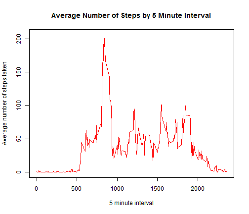
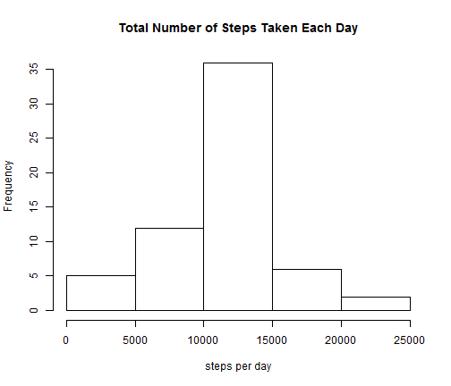
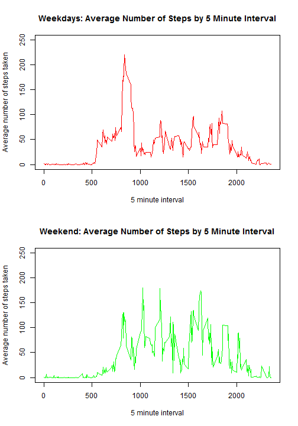

Reproducible Research - Peer Assignment 1
========================================================

## Introduction
It is now possible to collect a large amount of data about personal movement using activity monitoring devices such as a Fitbit, Nike Fuelband, or Jawbone Up. These type of devices are part of the "quantified self" movement - a group of enthusiasts who take measurements about themselves regularly to improve their health, to find patterns in their behavior, or because they are tech geeks. But these data remain under-utilized both because the raw data are hard to obtain and there is a lack of statistical methods and software for processing and interpreting the data. 

This assignment makes use of data from a personal activity monitoring device. This device collects data at 5 minute intervals through out the day. The data consists of two months of data from an anonymous individual collected during the months of October and November, 2012 and include the number of steps taken in 5 minute intervals each day.

## Loading and preprocessing the data
Set the working directory

```r
setwd("C:/Users/Jens/RepData_PeerAssessment1")
```

Load the data (i.e. read.csv())

```r
Data <- read.csv("activity.csv")
```
    
As all data is correctly uploaded, formatet and processed, and no further transformation is necessary at this 
point

## What is mean total number of steps taken per day?
For this part of the assignment I ignore the NA values. Hence, the first step is to delete
all observations (rows) that contain any NA values. 


```r
DataNoNA <- Data[complete.cases(Data),]
```

Next, I make a histogram of the total steps taken each day, as well as calculating the mean and 
median number of steps taken each day.


```r
#Sum steps by day
StepsDay <- aggregate(steps ~ date, data=DataNoNA, FUN=sum)
```

Now we create the histogram

```r
hist(StepsDay[,2], main="Total Number of Steps Taken Each Day", xlab="steps per day")
```

 

Finally, we calculate and report the mean and median

```r
#Calculate and report the mean and median total number of steps taken per day
mean(StepsDay[,2])
```

```
## [1] 10766
```

```r
median(StepsDay[,2])
```

```
## [1] 10765
```
Thus, the median of the dataset is 10,765 steps per day and the average is 10,766.19 steps per day

## What is the average daily activity pattern?
Now I create a time series plot (i.e. type = "l") of the 5-minute interval (x-axis) and the average number of steps taken, averaged across all days (y-axis). First I aggregate the average steps by 5 minute interval

```r
#Estimate the average steps by 5-minute time interval
Data5Min <- aggregate(steps ~ interval, data=DataNoNA, FUN=mean)
```

Then I create the plot: 

```r
#Make plot
matplot(Data5Min[,1], Data5Min[,2], type="l", xlab="5 minute interval", col="red", 
        ylab="Average number of steps taken", main="Average Number of Steps by 5 Minute Interval")
```

 

Next step is to estimate the 5-minute interval that, on average across all the days in the dataset, contains the maximum number of steps:

```r
Data5Min[max(Data5Min[,2]),1]
```

```
## [1] 1705
```
Thus, the 5 minute interval labelled "1705" does on average contain the most steps over the day    

## Imputing missing values
There are a number of days/intervals where there are missing values (coded as NA). The presence of missing days may introduce bias into some calculations or summaries of the data. Therefore, I will calculate and report the total number of missing values in the dataset (i.e. the total number of rows with NAs):

```r
#Calculate missing values by subtracting the number of actual values 
#from the total number of observations
nrow(Data)-sum(complete.cases(Data))
```

```
## [1] 2304
```
Thus, there 2304 observations (rows) that contain NA values

Next I will devise a strategy for filling in all of the missing values in the dataset. The chosen strategy is simply to replace the NA values with the overall mean for the respective 5 minute interval. The code and procudere to accomplish this operation is as follows:

```r
#Fill in the NAs with the mean value for that 5 minute interval
Data5Min <- aggregate(steps ~ interval, data=DataNoNA, FUN=mean) #Create averages for 5 minute intervals
DataRevised <- as.matrix(Data, ncol=3) #Create new dataset for filling in NAs
    for (i in 1:nrow(DataRevised)) {
      if (is.na(DataRevised[i,1])) {
        DataRevised[i,1] <- Data5Min[which(Data5Min[,1]==Data[i,3]),2]
      } 
    }
DataRevised <- data.frame(DataRevised) #Change format from matrix to data frame
DataRevised[,1] <- as.numeric(as.character(DataRevised[,1])) #Change to numeric format  
DataRevised[,2] <- as.Date(DataRevised[,2], format="%Y-%m-%d") #Change to date format
DataRevised[,3] <- as.numeric(as.character(DataRevised[,3])) #Change to numeric format
```

Finally I will create a histogram of the total number of steps taken each day, and calculate and report the mean and median total number of steps taken per day. First I agregate the steps taken per day:

```r
#Sum steps by day
StepsDay <- aggregate(steps ~ date, data=DataRevised, FUN=sum)
```
Then I can plot the histogram:

```r
hist(StepsDay[,2], main="Total Number of Steps Taken Each Day", xlab="steps per day")
```

 
Finally, I can estimate and report the mean and median of the revised data:

```r
#Calculate and report the mean and median total number of steps taken per day
mean(StepsDay[,2])
```

```
## [1] 10766
```

```r
median(StepsDay[,2])
```

```
## [1] 10766
```
The result of the of the strategy for filling in NAs via the mean results in more observations at the mean, and therefore the histogram is more clustered towards the mean of the distribution. Naturally the median is slaightly different and now equals the mean, which is unchanged.


## Are there differences in activity patterns between weekdays and weekends?
I will use the dataset with the filled-in missing values for this part, i.e. "DataRevised". First I create a new factor variable in the dataset with two levels - "weekday" and "weekend":

```r
DataRevised$week <- weekdays(DataRevised[,2]) #Define the weekday for each observation
DataRevFac <- DataRevised #Define new dataset to hold the new factor variable
#Transform the days into either "weekday" or "weekend"
    for (i in 1:nrow(DataRevised)) {
      if (DataRevised[i,4]=="Saturday") {
        DataRevFac[i,4] <- "Weekend"        
      }
      if (DataRevised[i,4]=="Sunday") {
        DataRevFac[i,4] <- "Weekend"
      } else {
        DataRevFac[i,4] <- "Weekday"
      }
      
    }
DataRevFac$week <- as.factor(DataRevFac$week) #Define new variable as factor
```

Next step is to create a panel plot containing a time series plot (i.e. type = "l") of the 5-minute interval (x-axis) and the average number of steps taken, averaged across all weekday days or weekend days (y-axis). First I aggregate the average steps by 5 minute interval and seperate the observations into "weekday" and "weekend":

```r
#Average daily steps by 5 minute interval over weekdays and weekends
StepsWeekDay <- aggregate(steps ~ interval, data=DataRevFac[DataRevFac$week=="Weekday",], FUN=mean)
StepsWeekEnd <- aggregate(steps ~ interval, data=DataRevFac[DataRevFac$week=="Weekend",], FUN=mean)
```

Then I can make the two plots comparing the average number of steps taken by 5 minute interval on weekdays and weekends:

```r
par(mfrow=c(2,1)) 
matplot(StepsWeekDay[,1], StepsWeekDay[,2], type="l", xlab="5 minute interval", col="red", ylim=c(0,250), 
        ylab="Average number of steps taken", main="Weekdays: Average Number of Steps by 5 Minute Interval")
matplot(StepsWeekEnd[,1], StepsWeekEnd[,2], type="l", xlab="5 minute interval", col="green", ylim=c(0,250),
        ylab="Average number of steps taken", main="Weekend: Average Number of Steps by 5 Minute Interval")
```

 

Thus, we see that the steps are clusted differently during weeksdays, where the most steps are taken in the beginnign of the days. During weekends, the amount of steps seem to be more equally distributed. This is most likely a result of a fixed work schedule during weekdays, and more free time and flexibility during weekends.
